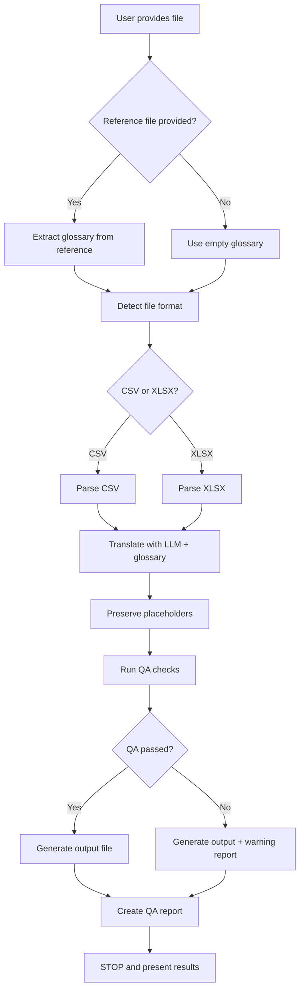

# Game Localization

## Overview

This skill provides a complete AI-powered game localization workflow that:
- Automatically detects and handles CSV/XLSX file formats
- Extracts domain-specific terminology from existing translations
- Preserves game-specific placeholders and formatting
- Performs quality assurance checks
- Outputs translated files in the original format

## Quick Start

### Basic Translation
```bash
python scripts/translate.py input.csv --target zh-CN
```

### With Reference File (for glossary extraction)
```bash
python scripts/translate.py new_content.csv --target zh-CN --reference existing_translations.csv
```

## Workflow Decision Tree



## Step 1: Glossary Extraction (Optional)

If a reference file is provided, the skill extracts frequently-used terms to ensure translation consistency.

**Extraction criteria**:
- Terms appearing 2+ times
- Paired source-target translations
- Game-specific terminology (character names, items, locations)

**Example glossary** (from Fallout Shelter):
- Vault → 避难所
- Dweller → 居民
- Deathclaw → 死爪
- Stimpak → 治疗针

For detailed extraction logic, see [references/glossary_extraction.md](references/glossary_extraction.md)

## Step 2: Translation

The skill uses LLM translation with:
- Glossary context for consistency
- Placeholder preservation instructions
- Game localization best practices

**Supported placeholder formats**:
- Positional: `{0}`, `{1}`, `{2}`
- Named: `{player_name}`, `{item_count}`
- Printf-style: `%s`, `%d`, `%f`
- Unity rich text: `<color>`, `<size>`, `<b>`, `<i>`

For complete placeholder patterns, see [references/placeholder_patterns.md](references/placeholder_patterns.md)

## Step 3: Quality Assurance

Automated QA checks include:

### Critical Checks (must pass)
1. **Placeholder count**: Source and target must have same number of placeholders
2. **Placeholder format**: Placeholders must maintain exact format
3. **Encoding**: Output must be valid UTF-8

### Warning Checks (flagged for review)
1. **Length variance**: Target text >150% or <50% of source length
2. **Numeric consistency**: Numbers should generally be preserved
3. **Special characters**: Unusual character usage flagged

For detailed QA rules, see [references/qa_rules.md](references/qa_rules.md)

## Step 4: Output and Report

The skill generates:
1. **Translated file**: Same format as input (CSV/XLSX)
2. **QA report**: JSON file with validation results

**QA Report Structure**:
```json
{
  "total_rows": 12374,
  "passed": 12350,
  "warnings": 24,
  "critical_errors": 0,
  "issues": [
    {
      "row": 42,
      "type": "length_variance",
      "severity": "warning",
      "message": "Target text 180% longer than source"
    }
  ]
}
```

Then **STOP** and present results to user.

## 🛑 Exit Criteria (Stop Conditions)

The skill will **automatically STOP** when:
1. ✅ Translated file has been saved to output path
2. ✅ QA report has been generated
3. ✅ All checks completed (placeholder validation, length checks, encoding)

**Do NOT**:
- ❌ Attempt to "improve" or "refine" the translation unless user explicitly requests
- ❌ Re-run translation on the same file automatically
- ❌ Generate multiple versions or iterations

**After completion**:
- Present the output file path
- Show QA report summary (passed/warnings/errors)
- Ask user: "Translation complete. Would you like to review the QA report details or make adjustments?"
- **Wait for user feedback** before any further action

## Important Notes

### Single-Pass Execution
This skill is designed for **single-pass execution**:
1. Run once per file
2. Generate output and QA report
3. **STOP** and wait for user review

### Iteration Guidelines
If translation needs improvement:
- ❌ Do NOT automatically re-run
- ✅ Ask user what specific aspects to adjust
- ✅ User can re-run with different parameters if needed (e.g., different glossary, target language)

### Common Pitfall to Avoid
**WRONG**: "The translation looks good, but let me refine it one more time to make it perfect..."
**CORRECT**: "Translation complete. Output saved to `output.csv`. QA report shows 12,350 passed, 24 warnings, 0 critical errors. Ready for your review."

## Advanced Features

### Custom Glossary
Provide a custom glossary file:
```bash
python scripts/translate.py input.csv --target zh-CN --glossary custom_terms.json
```

### Batch Processing
Process multiple files:
```bash
python scripts/batch_translate.py --input-dir ./game_texts --target zh-CN
```

### Configuration
Customize translation behavior via `config.yaml`:
- LLM model selection
- Temperature settings
- QA thresholds
- Placeholder patterns

For advanced usage, see [references/advanced_usage.md](references/advanced_usage.md)

## Scripts Reference

### extract_glossary.py
Extracts terminology from reference translations.

**Usage**:
```bash
python scripts/extract_glossary.py reference.csv --min-frequency 2 --output glossary.json
```

### translate.py
Main translation script.

**Usage**:
```bash
python scripts/translate.py input.csv --target zh-CN [--reference ref.csv] [--glossary terms.json]
```

### config.py
Configuration management for API keys, model settings, etc.

## Resources

This skill includes:
- `scripts/` - Python scripts for extraction, translation, and QA
- `references/` - Detailed documentation for advanced features
- `examples/` - Sample input/output files for testing

## Troubleshooting

**Issue**: Placeholders not preserved
- Check [references/placeholder_patterns.md](references/placeholder_patterns.md) for supported formats
- Verify input file encoding is UTF-8

**Issue**: QA warnings about length
- Review flagged rows in QA report
- Adjust length threshold in `config.yaml` if needed

**Issue**: Glossary not applied
- Ensure reference file has paired source-target columns
- Check minimum frequency threshold (default: 2)

For more help, see [references/troubleshooting.md](references/troubleshooting.md)
